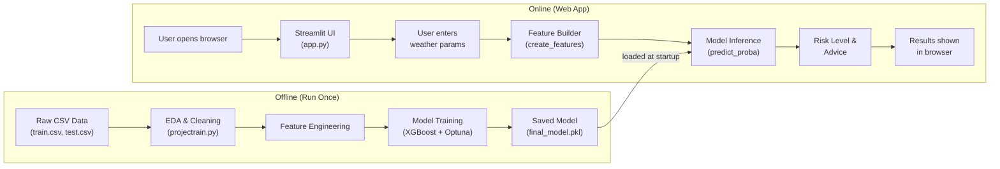
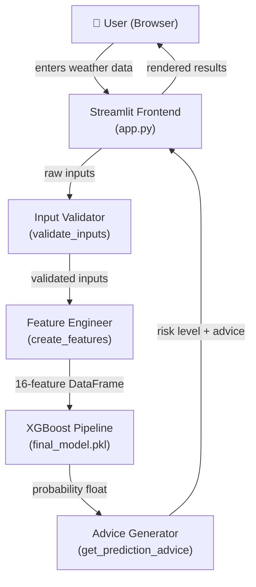
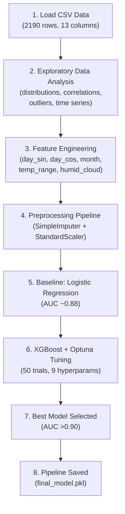
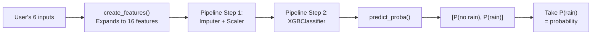

# SkyCast – Project Walkthrough

> **What is this document?**
> A complete, beginner-friendly walkthrough of the SkyCast project.
> Read this before an interview, presentation, or code review so you can explain every part of the system with confidence.

---

## 1. Project Overview

### What This Project Does

SkyCast is a **machine learning–powered web application** that predicts the **probability of rainfall** for a given day based on weather parameters like temperature, humidity, cloud cover, and wind speed.

A user opens the app in a browser, enters (or selects) weather conditions, clicks "Predict Rainfall," and instantly sees:

| Output | Example |
|---|---|
| **Rain probability** | 73.2 % |
| **Risk level** | High Risk |
| **Practical advice** | 🌧️ Bring an umbrella |

### Why It Exists

Weather forecasting usually requires expensive infrastructure, radar data, and complex numerical models. SkyCast shows that a **lightweight ML model trained on historical weather data** can deliver useful rain-or-no-rain predictions for tropical regions — all running on a single laptop with a clean web UI.

### Real-World Problem It Solves

People in tropical and subtropical coastal regions (Southeast Asia, South India, coastal Australia) experience frequent but unpredictable rain. SkyCast helps them:

- Decide whether to carry an umbrella.
- Plan outdoor activities, farming schedules, or travel.
- Understand how weather variables (humidity, cloud cover, temperature) relate to rain.

### Target Users

| User | Why they'd use SkyCast |
|---|---|
| Everyday people in tropical areas | Quick rain check before going out |
| Farmers / agricultural workers | Plan irrigation and harvesting |
| Students & educators | Learn how ML solves real-world problems |
| ML portfolio reviewers / interviewers | Evaluate the builder's skills |

---

## 2. High-Level Architecture

### Overall System Flow

SkyCast has two main parts:

1. **Offline ML Pipeline** (`projectrain.py`) — runs once to train and save the model.
2. **Online Web App** (`app.py`) — loads the saved model and serves predictions to users via Streamlit.



### Component Interactions



### Request / Response Flow

Since SkyCast uses **Streamlit** (not a REST API), the "request/response" happens inside a single Python process:

1. **Request:** User fills the form and clicks "🚀 Predict Rainfall."
2. **Processing:** Streamlit re-runs `main()`, calls `validate_inputs()` → `create_features()` → `model.predict_proba()` → `get_prediction_advice()`.
3. **Response:** Streamlit renders the results directly into the same page.

> **Key point for interviews:** There is no separate backend server or HTTP API. Streamlit is both the frontend renderer and the backend executor in one process.

### Data Flow

```
User Input (5 params + date)
        │
        ▼
┌─────────────────────────────────┐
│  create_features()              │
│  Expands 5 inputs → 16 features│
│  (adds defaults for pressure,  │
│   dewpoint, sunshine, etc.)    │
└─────────────────────────────────┘
        │
        ▼
┌─────────────────────────────────┐
│  final_model.pkl                │
│  Step 1: StandardScaler        │
│  Step 2: XGBClassifier         │
│  Output: probability [0, 1]    │
└─────────────────────────────────┘
        │
        ▼
┌─────────────────────────────────┐
│  get_prediction_advice()        │
│  Maps probability → risk level │
│  + color + advice string       │
└─────────────────────────────────┘
        │
        ▼
   Displayed to User
```

---

## 3. Folder Structure Explanation

```
SkyCast/
├── app.py                # 🌐 Main Streamlit web application (236 lines)
├── projectrain.py        # 🧪 Full ML pipeline: EDA → training → model export (635 lines)
├── final_model.pkl       # 📦 Serialized sklearn Pipeline (preprocessor + XGBoost)
├── requirements.txt      # 📋 Python dependencies (6 packages)
├── README.md             # 📖 Project overview and setup instructions
├── .gitignore            # 🚫 Files excluded from version control
└── venv/                 # 🐍 Python virtual environment (not committed)
```

### File-by-File Explanation

| File | Purpose | Why It Exists |
|---|---|---|
| **`app.py`** | The user-facing web application. Loads the model, collects inputs, runs prediction, and shows results. | This is the **entry point** users interact with — the "product." |
| **`projectrain.py`** | The entire data science workflow: load CSVs → explore data → engineer features → train models → save the best one. Originally a Google Colab notebook. | Documents the **research process** — how and why the model was built the way it is. |
| **`final_model.pkl`** | A serialized (pickled) scikit-learn `Pipeline` object containing both the preprocessing steps (imputation + scaling) and the trained XGBoost classifier. | Allows the web app to **skip retraining** — it just loads and predicts. |
| **`requirements.txt`** | Lists exact package versions needed: `streamlit`, `numpy`, `scikit-learn==1.6.1`, `xgboost`, `joblib`, `pandas`. | Ensures anyone can **reproduce** the environment with `pip install -r requirements.txt`. |
| **`README.md`** | High-level documentation: features, installation, usage, model insights, performance metrics. | The **first thing** a visitor sees on GitHub. |
| **`.gitignore`** | Excludes virtual environments, data CSVs, model `.pkl` files, IDE settings, Jupyter checkpoints, and OS files from Git. | Keeps the repository **clean** and prevents accidental commits of large or sensitive files. |
| **`venv/`** | Local Python virtual environment directory. | Isolates project dependencies from the system Python. **Not committed** to Git (listed in `.gitignore`). |

> **Interview tip:** The `.gitignore` excludes `*.pkl` and `train.csv`/`test.csv`. This means the model and data files are **not** tracked in Git — they must be generated locally or downloaded separately. The `final_model.pkl` in the repo may have been force-committed or committed before the `.gitignore` rule was added.

---

## 4. End-to-End Execution Flow

### What happens from the moment the user starts the application until the final result is produced?

---

**Step 1 — User launches the app**

```bash
streamlit run app.py
```

Streamlit starts a local web server at `http://localhost:8501` and opens the browser.

---

**Step 2 — Model is loaded (once)**

```python
@st.cache_resource
def load_model():
    return joblib.load('final_model.pkl')
```

The `@st.cache_resource` decorator ensures the model is loaded from disk **only once** and then cached in memory for all subsequent interactions. This avoids the overhead of deserializing a ~200 KB pickle file on every user click.

> **What is `@st.cache_resource`?** A Streamlit decorator (a special annotation) that tells Streamlit: "Run this function once, store the result, and reuse it on every page re-run."

---

**Step 3 — UI renders**

Streamlit renders:
- A header ("🌧️ SkyCast") and subtitle.
- A **sidebar** showing model metadata (accuracy, training data size, algorithm).
- A **form** with inputs: date, max/min temperature, humidity slider, cloud cover slider, wind speed slider.
- A **presets dropdown** ("Sunny," "Partly Cloudy," "Cloudy") that auto-fills the inputs.
- A **Model Status** panel on the right.

---

**Step 4 — User fills in weather parameters and clicks "🚀 Predict Rainfall"**

The form captures these user inputs:

| Input | Widget Type | Default | Range |
|---|---|---|---|
| Date | Date picker | Today | Any valid date |
| Max Temperature (°C) | Number input | 30.0 | -50 to 60 |
| Min Temperature (°C) | Number input | 20.0 | -50 to 60 |
| Humidity (%) | Slider | 75 | 0–100 |
| Cloud Cover (%) | Slider | 50 | 0–100 |
| Wind Speed (km/h) | Slider | 15 | 0–50 |

---

**Step 5 — Input validation**

```python
def validate_inputs(maxtemp, mintemp, humidity, cloud, wind):
```

Checks:
- Temperatures within -50°C to 60°C.
- Min temperature ≤ Max temperature.
- Humidity, cloud cover, wind speed within valid ranges.
- Returns an error message string if any check fails, or `None` if all inputs are valid.

---

**Step 6 — Feature engineering**

```python
def create_features(date, maxtemp, mintemp, humidity, cloud, wind):
```

This is where the magic happens. The user provides **6 inputs**, but the model expects **16 features**. This function bridges the gap:

| Feature | Source | How It's Computed |
|---|---|---|
| `day` | Date | Day-of-year (1–366) via `date.timetuple().tm_yday` |
| `pressure` | Hardcoded | Fixed at `1015.0` hPa (tropical sea-level average) |
| `maxtemp` | User input | Passed through directly |
| `temparature` | Computed | `(maxtemp + mintemp) / 2` — average temperature |
| `mintemp` | User input | Passed through directly |
| `dewpoint` | Approximated | Set equal to `mintemp` (a meteorological heuristic) |
| `humidity` | User input | Passed through directly |
| `cloud` | User input | Passed through directly |
| `sunshine` | Hardcoded | Fixed at `5` hours |
| `winddirection` | Hardcoded | Fixed at `180°` (south) |
| `windspeed` | User input | Passed through directly |
| `temp_range` | Computed | `maxtemp - mintemp` |
| `humid_cloud` | Computed | `humidity * cloud` — interaction feature |
| `day_sin` | Computed | `sin(2π × day / 366)` — cyclical seasonal encoding |
| `day_cos` | Computed | `cos(2π × day / 366)` — cyclical seasonal encoding |
| `month` | Computed | `min(((day - 1) // 30) + 1, 12)` — approximate month |

Returns a single-row `pandas DataFrame` with all 16 columns.

> **Why cyclical encoding?** Day-of-year is circular: day 365 and day 1 are neighbors, but numerically they're far apart. Sine/cosine encoding preserves this circular relationship so the model understands that December 31 and January 1 are close in time.

---

**Step 7 — Model inference**

```python
probability = model.predict_proba(features)[0, 1]
```

The loaded `final_model.pkl` is a **scikit-learn Pipeline** with two stages:

1. **Preprocessing** — `SimpleImputer(strategy='median')` + `StandardScaler()` applied to all columns.
2. **XGBClassifier** — The tuned XGBoost model that outputs class probabilities.

`predict_proba()` returns a 2D array: `[[P(no rain), P(rain)]]`. We take `[0, 1]` — the probability of rain.

---

**Step 8 — Risk classification**

```python
def get_prediction_advice(probability):
```

Maps the probability to a human-friendly risk level:

| Probability Range | Risk Level | Color | Advice |
|---|---|---|---|
| > 80% | Very High Risk | 🔴 error | Bring umbrella and waterproof gear |
| 60–80% | High Risk | 🔴 error | Bring an umbrella |
| 40–60% | Moderate Risk | 🟡 warning | Consider light jacket |
| 20–40% | Low Risk | 🟢 success | Light jacket optional |
| < 20% | Very Low Risk | 🟢 success | Perfect for outdoor activities |

---

**Step 9 — Results displayed**

Streamlit renders a two-column result layout:

- **Left column:** Rain probability metric, risk level badge, and advice with appropriate color (error/warning/success).
- **Right column:** Weather summary showing all input parameters and the computed day-of-year.
- **Below:** A model confidence note describing the model's training data and accuracy.

---

**Step 10 — Error handling**

If anything goes wrong during prediction, the app catches the exception and displays:

```python
except Exception as e:
    st.error(f"Prediction failed: {e}")
```

This prevents the app from crashing and shows a user-friendly error message.

---

## 5. Core Features

### Feature 1: Rain Probability Prediction

| Aspect | Detail |
|---|---|
| **Purpose** | Predict how likely it is to rain on a given day based on weather conditions |
| **How it works** | User inputs are transformed into 16 engineered features, fed into a trained XGBoost model, which outputs a probability between 0 and 1 |
| **Files involved** | `app.py` (lines 37–58 for feature creation, line 194 for prediction), `final_model.pkl` |
| **Input** | Date, max/min temperature, humidity, cloud cover, wind speed |
| **Output** | Probability percentage (e.g., "73.2%") |
| **Interview Explanation** | "The user provides 6 weather parameters. My feature engineering function expands these into 16 features — including cyclical time encoding and interaction terms — then feeds them into a pre-trained XGBoost pipeline that returns a rain probability." |

---

### Feature 2: Risk Level Classification & Advice

| Aspect | Detail |
|---|---|
| **Purpose** | Convert a raw probability into an actionable, human-readable recommendation |
| **How it works** | The `get_prediction_advice()` function uses threshold-based rules to map probability ranges to five risk levels, each with a color code and practical advice |
| **Files involved** | `app.py` (lines 60–70) |
| **Input** | Rain probability (float between 0 and 1) |
| **Output** | Tuple of (risk_level, color, advice_string) |
| **Interview Explanation** | "Rather than just showing a number, I added a post-processing layer that converts the probability into five risk tiers with color-coded UI feedback and actionable advice — making the output meaningful for non-technical users." |

---

### Feature 3: Input Validation

| Aspect | Detail |
|---|---|
| **Purpose** | Prevent nonsensical or out-of-range inputs from reaching the model |
| **How it works** | `validate_inputs()` checks ranges for all five numeric inputs and ensures min temp ≤ max temp. Returns an error string or `None` |
| **Files involved** | `app.py` (lines 22–35) |
| **Input** | maxtemp, mintemp, humidity, cloud, wind |
| **Output** | Error message string or `None` |
| **Interview Explanation** | "I added a validation layer before the model to ensure data integrity. For example, it catches if someone enters a min temperature higher than the max, or humidity above 100%. This prevents garbage-in-garbage-out predictions." |

---

### Feature 4: Quick Weather Presets

| Aspect | Detail |
|---|---|
| **Purpose** | Let users quickly test predictions with realistic weather scenarios without manual entry |
| **How it works** | A dropdown offers "Sunny," "Partly Cloudy," and "Cloudy" presets that auto-fill all input fields with typical values for those conditions |
| **Files involved** | `app.py` (lines 156–164) |
| **Input** | Preset selection from dropdown |
| **Output** | Pre-filled form values |
| **Interview Explanation** | "I added presets as a UX feature to reduce friction. A user can instantly see how different weather conditions affect rain probability without guessing realistic values for every parameter." |

---

### Feature 5: Model Caching

| Aspect | Detail |
|---|---|
| **Purpose** | Avoid re-loading the 200 KB model file on every Streamlit re-run |
| **How it works** | `@st.cache_resource` decorator on `load_model()` ensures `joblib.load()` runs only once; subsequent re-runs reuse the cached model object |
| **Files involved** | `app.py` (lines 14–20) |
| **Input** | File path `'final_model.pkl'` |
| **Output** | Cached sklearn Pipeline object |
| **Interview Explanation** | "Streamlit re-executes the entire script on every interaction. Without caching, the model would reload from disk on every button click. I used `@st.cache_resource` to load it once and keep it in memory, improving response time." |

---

### Feature 6: Feature Engineering (in the ML pipeline)

| Aspect | Detail |
|---|---|
| **Purpose** | Transform raw weather observations into features that improve model performance |
| **How it works** | Cyclical sine/cosine encoding of day-of-year, temperature range, humidity×cloud interaction term, approximate month extraction |
| **Files involved** | `projectrain.py` (lines 467–489) |
| **Input** | Raw columns: day, maxtemp, mintemp, humidity, cloud |
| **Output** | New columns: day_sin, day_cos, month, temp_range, humid_cloud |
| **Interview Explanation** | "I engineered five additional features. The most important is cyclical encoding — instead of feeding day-of-year as a linear number (where 365 is far from 1), I used sine and cosine so the model understands that late December and early January are seasonally similar." |

---

### Feature 7: Hyperparameter Tuning with Optuna

| Aspect | Detail |
|---|---|
| **Purpose** | Find the best XGBoost hyperparameters automatically instead of manual trial-and-error |
| **How it works** | Optuna runs 50 trials, each testing a different combination of hyperparameters (max_depth, learning_rate, subsample, regularization, etc.) and evaluating via 5-fold stratified cross-validation AUC-ROC |
| **Files involved** | `projectrain.py` (lines 541–574) |
| **Input** | Training data (X_train, y_train) |
| **Output** | Best hyperparameter set achieving AUC-ROC > 0.90 |
| **Interview Explanation** | "I used Optuna, a Bayesian optimization framework, to tune 9 hyperparameters over 50 trials. Each trial ran 5-fold stratified cross-validation with AUC-ROC as the metric. This is more efficient than grid search because Optuna learns from previous trials to focus on promising regions of the hyperparameter space." |

---

## 6. Database Layer

> **SkyCast does not use a database.**

- Training data comes from static CSV files (`train.csv`, `test.csv`) sourced from the [Kaggle Playground Series S5E3](https://www.kaggle.com/competitions/playground-series-s5e3) competition.
- The trained model is persisted as a **pickle file** (`final_model.pkl`), not in a database.
- The web app is **stateless** — it does not store user inputs or prediction results anywhere.

### Data Schema (CSV Files)

The training data (`train.csv`) has this schema:

| Column | Type | Description |
|---|---|---|
| `id` | int | Row identifier |
| `day` | int | Day of year (1–366) |
| `pressure` | float | Atmospheric pressure (hPa) |
| `maxtemp` | float | Maximum temperature (°C) |
| `temparature` | float | Mean temperature (°C) — *note: typo in original data* |
| `mintemp` | float | Minimum temperature (°C) |
| `dewpoint` | float | Dew point temperature (°C) |
| `humidity` | float | Relative humidity (%) |
| `cloud` | float | Cloud cover (%) |
| `sunshine` | float | Hours of sunshine |
| `winddirection` | float | Wind direction (degrees, 0–360) |
| `windspeed` | float | Wind speed (km/h) |
| `rainfall` | int | **Target variable** — 0 (no rain) or 1 (rain) |

**Key facts:**
- Train set: **2,190 rows** (~6 years of daily observations)
- Test set: **730 rows** (~2 years)
- Class distribution: **75% rain (1)** / **25% no rain (0)** — imbalanced
- Only 1 missing value in the entire dataset (test set, `winddirection` column)

---

## 7. API Layer

> **SkyCast does not have a REST API.**

The application uses **Streamlit**, which is a Python framework that combines frontend rendering and backend logic in a single process. There are no HTTP endpoints, no request/response JSON objects, and no API routes.

### How It Works Instead

| Traditional Web App | SkyCast (Streamlit) |
|---|---|
| Frontend sends HTTP request to backend API | Streamlit re-runs the Python script on every user interaction |
| Backend processes request, returns JSON | Python functions execute directly, results rendered in-place |
| Separate server processes | Single Python process serves both UI and logic |

> **Interview tip:** If asked "Does your project have an API?", you can say: "The current version uses Streamlit, which handles UI and logic in one process. If I needed to serve predictions to other applications, I would wrap the model in a FastAPI endpoint with a `/predict` route that accepts weather parameters as JSON and returns the probability."

---

## 8. AI/ML Components

### Simple Explanation First

Imagine you're looking at 6 years of weather records — temperature, humidity, clouds, wind — and for each day you know whether it rained. You want to find patterns: "When humidity is above 80% and clouds are above 70%, it usually rains." That's essentially what the model does, but with thousands of such rules learned automatically from data.

### Technical Explanation

#### Model Used: XGBoost Classifier

**XGBoost** (eXtreme Gradient Boosting) is an ensemble learning algorithm that builds many small decision trees, one after another, where each new tree corrects the mistakes of the previous ones.

> **What is a decision tree?** A flowchart-like model that asks yes/no questions about features (e.g., "Is humidity > 75?") to arrive at a prediction.
>
> **What is "ensemble"?** Combining many weak models (small trees) to create one strong model.
>
> **What is "gradient boosting"?** Each new tree focuses on the data points the previous trees got wrong, gradually reducing errors.

**Why XGBoost?**
- Handles tabular (spreadsheet-like) data extremely well.
- Built-in regularization prevents overfitting.
- Fast training, even with hyperparameter search.
- Widely used in Kaggle competitions for structured data.

#### Baseline Model: Logistic Regression

Before using XGBoost, a **Logistic Regression** model was trained as a baseline:

```
Logistic Regression CV AUC: ~0.88
XGBoost (tuned)   CV AUC: >0.90
```

> **What is a baseline?** A simple model you train first to set a performance floor. If your fancy model can't beat the baseline, something is wrong.

#### Training Process (Step-by-Step)



#### Hyperparameters Tuned by Optuna

| Hyperparameter | Search Range | What It Controls |
|---|---|---|
| `max_depth` | 3–10 | How deep each decision tree can grow (deeper = more complex) |
| `learning_rate` | 0.01–0.3 | How much each new tree corrects errors (smaller = more cautious) |
| `n_estimators` | 50–300 | Total number of trees in the ensemble |
| `subsample` | 0.5–1.0 | Fraction of training data used per tree (prevents overfitting) |
| `colsample_bytree` | 0.5–1.0 | Fraction of features used per tree |
| `min_child_weight` | 1–10 | Minimum data points needed in a leaf node |
| `lambda` (L2 reg) | 1e-8–10 | Penalty for large model weights (prevents overfitting) |
| `alpha` (L1 reg) | 1e-8–10 | Penalty that can zero out unimportant features |

#### Inference Process (at Prediction Time)



#### Feature Importance (from EDA)

The correlation analysis in `projectrain.py` revealed these features are most predictive of rainfall:

| Feature | Correlation with Rainfall | Why It Matters |
|---|---|---|
| `humidity` | +0.64 | Higher humidity → more moisture → more likely to rain |
| `cloud` | +0.64 | More cloud cover → more likely to rain |
| `dewpoint` | moderate positive | High dewpoint = air is saturated with moisture |
| `sunshine` | moderate negative | Less sunshine → more clouds → more rain |

#### Class Imbalance Handling

The dataset is **imbalanced**: 75% of days have rain, only 25% are dry.

Strategies used (visible in code):
- **Stratified K-Fold Cross-Validation** (`StratifiedKFold`): Ensures each fold maintains the 75/25 ratio, so the model is evaluated fairly.
- **AUC-ROC as the metric** (instead of accuracy): AUC-ROC is not fooled by class imbalance — a model that always predicts "rain" would get 75% accuracy but a low AUC.

> **What is AUC-ROC?** It measures how well the model distinguishes between rain and no-rain across all possible thresholds. A score of 1.0 is perfect; 0.5 is random guessing. SkyCast achieves >0.90 — excellent.

---

## 9. Design Decisions

### Decision 1: XGBoost over Deep Learning

| Aspect | Detail |
|---|---|
| **Choice** | XGBoost (gradient-boosted trees) |
| **Alternatives considered** | Neural networks, Random Forest, SVM |
| **Why chosen** | XGBoost excels on tabular data with few hundred features. Deep learning needs much more data and is harder to interpret. Random Forest is competitive but XGBoost typically outperforms it. |
| **Trade-off** | Slightly more complex to tune (hence Optuna), but worth the performance gain. |
| **What code shows** | `projectrain.py` lines 537–576 — XGBoost with Optuna tuning |

---

### Decision 2: Streamlit over Flask/FastAPI

| Aspect | Detail |
|---|---|
| **Choice** | Streamlit for the web interface |
| **Alternatives considered** | Flask + HTML templates, FastAPI + React, Gradio |
| **Why chosen** | Streamlit allows building a full interactive web app in pure Python — no HTML, CSS, or JavaScript required. Perfect for ML demo apps and rapid prototyping. |
| **Trade-off** | Less customizable than Flask/React. Not suitable for production-scale apps. No REST API out of the box. Re-executes the entire script on every interaction (mitigated by `@st.cache_resource`). |
| **What code shows** | `app.py` — entire file uses Streamlit widgets |

---

### Decision 3: Hardcoded Defaults for Missing Features

| Aspect | Detail |
|---|---|
| **Choice** | Pressure=1015, sunshine=5, wind direction=180°, dewpoint=mintemp |
| **Alternatives considered** | Ask user for all 16 inputs, fetch from weather API, use model trained on fewer features |
| **Why chosen** | Reduces the form to only 5 intuitive inputs. Users shouldn't need to know atmospheric pressure or dew point. The defaults are meteorologically reasonable for tropical regions. |
| **Trade-off** | Predictions may be less accurate in non-tropical regions or extreme conditions. Fixed defaults mean the model can't leverage these features' variability. |
| **What code shows** | `app.py` lines 41–58 in `create_features()` |

---

### Decision 4: Cyclical Encoding for Day-of-Year

| Aspect | Detail |
|---|---|
| **Choice** | Encode `day` as `sin(2π·day/366)` and `cos(2π·day/366)` |
| **Alternatives considered** | Use raw day number, one-hot encode month, no time feature |
| **Why chosen** | Raw day numbers create a false discontinuity between day 365 and day 1. Cyclical encoding preserves the circular nature of seasons so the model understands Dec 31 ↔ Jan 1 continuity. |
| **Trade-off** | Adds two features but eliminates a major modeling artifact. Simple and well-established technique. |
| **What code shows** | `projectrain.py` lines 470–473 and `app.py` lines 55–56 |

---

### Decision 5: sklearn Pipeline for Model Serialization

| Aspect | Detail |
|---|---|
| **Choice** | Bundle `ColumnTransformer(Imputer + Scaler)` + `XGBClassifier` into a single `Pipeline`, then save with `joblib.dump()` |
| **Alternatives considered** | Save model and preprocessor separately, use ONNX format, save only model weights |
| **Why chosen** | A single Pipeline ensures preprocessing and prediction always happen together in the correct order. Eliminates the risk of applying wrong scaling or missing imputation at prediction time. |
| **Trade-off** | Tightly couples preprocessing to the model. Changing the scaler requires retraining. But for this project's scope, the coupling is an advantage (simplicity and correctness). |
| **What code shows** | `projectrain.py` lines 581–585 |

---

### Decision 6: Optuna over Grid Search / Random Search

| Aspect | Detail |
|---|---|
| **Choice** | Optuna Bayesian optimization (50 trials) |
| **Alternatives considered** | GridSearchCV, RandomizedSearchCV |
| **Why chosen** | With 9 hyperparameters, grid search is impractical (combinatorial explosion). Random search is better but wasteful. Optuna uses a Tree-structured Parzen Estimator (TPE) to intelligently sample promising regions. |
| **Trade-off** | Adds a dependency (`optuna`). Results vary across runs (though `random_state=42` is set for XGBoost). |
| **What code shows** | `projectrain.py` lines 541–568 |

---

### Decision 7: AUC-ROC as the Primary Metric

| Aspect | Detail |
|---|---|
| **Choice** | Evaluate models using AUC-ROC score |
| **Alternatives considered** | Accuracy, F1-score, precision, recall |
| **Why chosen** | The dataset has 75/25 class imbalance. A naive model predicting "rain" always gets 75% accuracy. AUC-ROC measures the model's ability to rank rain days higher than no-rain days across all thresholds, making it robust to imbalance. |
| **Trade-off** | AUC-ROC doesn't tell you the best threshold for deployment. In production, you'd also want to evaluate precision/recall at specific thresholds. |
| **What code shows** | `projectrain.py` lines 530–531, 560–561, 573–574 |

---

## 10. Common Interview Questions About This Project

### Q1: "What does your project do?"

**Strong Answer:**
"SkyCast is a machine learning web application that predicts the probability of rainfall based on weather parameters like temperature, humidity, and cloud cover. It's built with an XGBoost classifier trained on 6 years of tropical weather data, achieving an AUC-ROC above 0.90. The Streamlit frontend lets users input weather conditions and instantly see a rain probability, risk level, and practical advice."

---

### Q2: "Why did you choose XGBoost?"

**Strong Answer:**
"For tabular data with around 16 features and 2,000 rows, XGBoost consistently outperforms both simpler models and deep learning approaches. I validated this by first training a Logistic Regression baseline that achieved AUC 0.88, then the tuned XGBoost surpassed 0.90. XGBoost also handles the 75/25 class imbalance well and provides feature importance for interpretability."

---

### Q3: "How did you handle the class imbalance?"

**Strong Answer:**
"The dataset has 75% rain days and 25% dry days. I used stratified K-fold cross-validation to ensure each fold preserves this ratio, and evaluated with AUC-ROC instead of accuracy — since a naive model could achieve 75% accuracy by always predicting rain. The XGBoost model also supports class weighting internally."

---

### Q4: "What was the hardest part of this project?"

**Strong Answer:**
"Bridging the gap between the research notebook and a deployable app. The trained model expects 16 features, but asking users for atmospheric pressure and dew point would make the UI unusable. I designed the `create_features()` function to expand 5 intuitive inputs into 16 features using sensible defaults and derived calculations — balancing usability with prediction quality."

---

### Q5: "How would you improve this project?"

**Strong Answer:**
"Three concrete improvements: First, integrate a weather API like OpenWeatherMap to auto-fill current conditions and replace hardcoded defaults. Second, add historical trend visualizations so users can see seasonal patterns. Third, wrap the model in a FastAPI endpoint so it can serve predictions to mobile apps or other services, not just the Streamlit UI."

---

## 11. Key Takeaways

1. **SkyCast is an end-to-end ML project** — from raw data exploration to a deployed web interface. It covers the full data science lifecycle: EDA → feature engineering → model selection → hyperparameter tuning → deployment.

2. **The ML pipeline is well-structured**: baseline comparison (Logistic Regression vs. XGBoost), automated hyperparameter tuning (Optuna), proper evaluation (stratified CV + AUC-ROC), and clean model serialization (sklearn Pipeline).

3. **Feature engineering is the key differentiator**: Cyclical day encoding, temperature range, and humidity-cloud interaction features demonstrate domain knowledge applied to ML.

4. **The `create_features()` function is the bridge** between a user-friendly 5-input form and the model's 16-feature requirement. This is a practical engineering decision that balances usability and accuracy.

5. **Streamlit is used for rapid prototyping**, not production deployment. The `@st.cache_resource` pattern shows awareness of Streamlit's re-execution model.

6. **The codebase is small but complete**: ~870 lines of Python total, covering data science (EDA, visualization, modeling) and software engineering (web UI, validation, error handling, caching).

7. **Key numbers to remember**: 6 years of data, 2190 training rows, 16 features, 50 Optuna trials, AUC-ROC > 0.90, 5 risk levels, ~200 KB model file.

---

## Learn This Project Like a Story

> Imagine a farmer named Ravi who lives in a coastal village in South India.

Every morning, Ravi looks at the sky and wonders: *"Will it rain today? Should I harvest my crops now or wait?"* He checks his phone, but generic weather apps give forecasts for the nearest city, 50 km away. They say "partly cloudy" — not helpful.

One day, Ravi finds **SkyCast**. He opens it in his browser.

**The Receptionist (Streamlit UI)** greets him with a clean, simple form. "Tell me about today's weather," it says. Ravi enters what he can see and feel:
- It's hot — max 33°C, min 25°C.
- The air feels sticky — humidity 85%.
- The sky is mostly covered — clouds 80%.
- There's a gentle breeze — wind 12 km/h.

He clicks **"🚀 Predict Rainfall."**

**The Security Guard (Input Validator)** quickly checks: Are these numbers sensible? Is min temp really less than max temp? Is humidity between 0 and 100? Everything looks good. The guard waves Ravi's data through.

**The Translator (Feature Engineer)** steps in. The model behind the scenes speaks a different language — it needs 16 numbers, not 5. The translator converts Ravi's inputs:
- "Date? June 15th — that's day 166 of the year."
- "Let me encode that as a wave: sin and cos, so the model knows it's monsoon season."
- "Temperature range? 33 minus 25 = 8 degrees."
- "Humidity × Cloud? 85 × 80 = 6,800 — a compound moisture indicator."
- "Pressure? I'll assume 1015 hPa — standard for a coastal tropical area."

Now the translator hands over a neat table of 16 numbers.

**The Expert Consultant (XGBoost Model)** examines the numbers. This consultant has studied **6 years** of weather records — 2,190 days of temperatures, humidity, clouds, wind, and whether it rained. It learned thousands of rules like:
- "When humidity > 80% AND cloud > 70% AND it's monsoon season → rain is very likely."
- "When temperature range is small AND wind is low → stable, moist air → rain probable."

The consultant runs Ravi's data through hundreds of these rules (decision trees) and announces: **"78.3% chance of rain."**

**The Advisor (Risk Classifier)** translates this into plain language:
- 78.3% → **High Risk** 🔴
- Advice: **"🌧️ Bring an umbrella."**

**The Receptionist** displays everything on Ravi's screen: the probability, the risk level, the advice, and a summary of the weather he entered.

Ravi glances at his phone, grabs his umbrella, and heads out to harvest his crops before the rain comes. **SkyCast helped him make a better decision — in under 5 seconds.**

---

### The Characters, Mapped to Code

| Story Character | Code Component | File & Function |
|---|---|---|
| 🏢 Receptionist | Streamlit UI | `app.py` → `main()` |
| 🔒 Security Guard | Input Validator | `app.py` → `validate_inputs()` |
| 🔄 Translator | Feature Engineer | `app.py` → `create_features()` |
| 🧠 Expert Consultant | XGBoost Model | `final_model.pkl` → `predict_proba()` |
| 💡 Advisor | Risk Classifier | `app.py` → `get_prediction_advice()` |
| 📚 Consultant's Training | ML Pipeline | `projectrain.py` (entire file) |
| 📦 Consultant's Memory | Saved Model | `final_model.pkl` |
