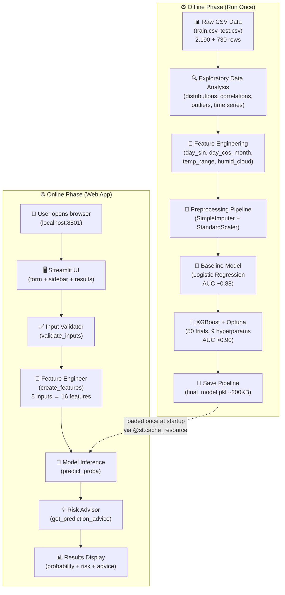
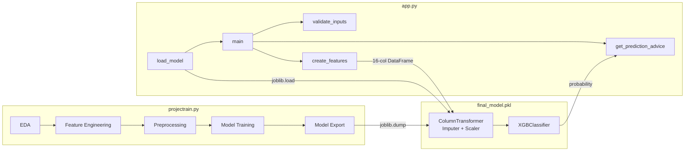
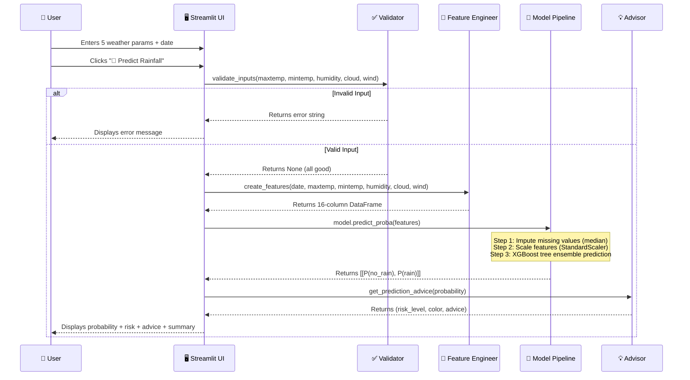
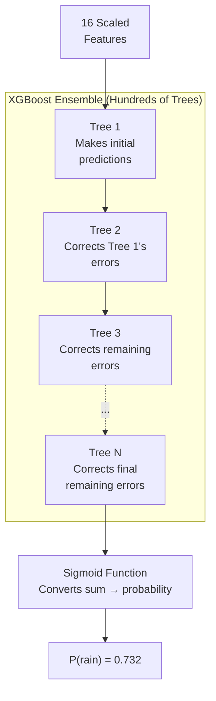
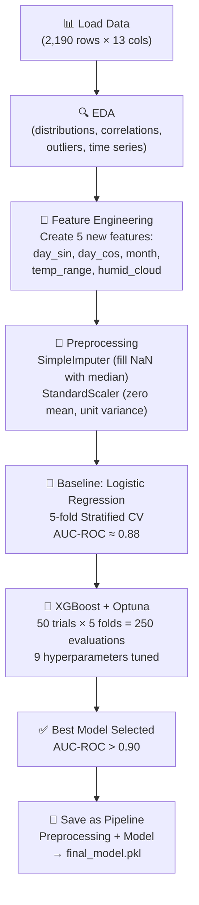
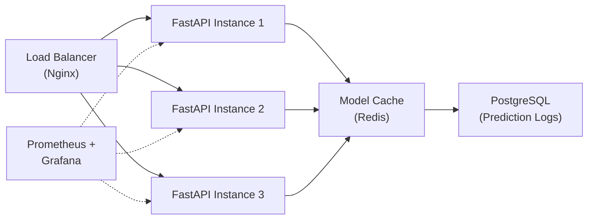

# SkyCast – Complete Project Walkthrough

> **How to use this document:**
> Read this before any interview, presentation, or code review. Every section is written so you can explain SkyCast confidently to both technical and non-technical people. Sections marked with 🎤 contain ready-to-speak interview answers.

---

## Table of Contents

1. [Project Overview](#1-project-overview)
2. [Elevator Pitch](#2-elevator-pitch-30-seconds)
3. [System Architecture](#3-system-architecture)
4. [Folder Structure Deep Dive](#4-folder-structure-deep-dive)
5. [End-to-End Flow](#5-end-to-end-flow)
6. [Feature Breakdown](#6-feature-breakdown)
7. [Core Files Explained](#7-core-files-explained)
8. [Database Layer](#8-database-layer)
9. [API Layer](#9-api-layer)
10. [AI / ML Components](#10-ai--ml-components)
11. [Design Decisions](#11-design-decisions)
12. [Challenges Faced](#12-challenges-faced)
13. [Performance & Scalability](#13-performance--scalability)
14. [Deployment](#14-deployment)
15. [Common Interview Questions About This Project](#15-common-interview-questions-about-this-project)
16. [Key Takeaways](#16-key-takeaways)
17. [Learn This Project Like a Story](#17-learn-this-project-like-a-story)

---

## 1. Project Overview

### Simple Explanation

SkyCast is a website where you type in today's weather conditions — how hot it is, how humid, how cloudy — and it tells you **"Will it rain today?"** along with a percentage chance and practical advice like "Bring an umbrella."

Behind the scenes, a computer program has studied 6 years of weather records and learned the patterns that lead to rain. When you ask it about today, it compares your numbers to those patterns and gives you an answer in seconds.

### Technical Explanation

SkyCast is a **binary classification web application** that predicts rainfall probability using an **XGBoost gradient-boosted tree** classifier. The model was trained on 2,190 daily weather observations (approximately 6 years) from the Kaggle Playground Series S5E3 competition, representing tropical/subtropical coastal climate data. The trained model — bundled as a scikit-learn `Pipeline` with preprocessing (imputation + scaling) — is served via a **Streamlit** web interface that accepts 5 user inputs, engineers 16 features, runs inference, and returns a risk-classified prediction.

### What problem does this project solve?

People in tropical and subtropical regions face **unpredictable daily rainfall**. Generic weather apps show city-level forecasts that may not reflect local conditions. SkyCast gives a **data-driven rain probability** based on the weather conditions you can observe right now — temperature, humidity, cloud cover, and wind.

### Why was it built?

Three reasons:

1. **Practical value** — Help people in tropical regions make quick, informed decisions about carrying umbrellas, planning outdoor activities, or scheduling agricultural work.
2. **End-to-end ML demonstration** — Show the complete lifecycle from raw data → EDA → feature engineering → model selection → hyperparameter tuning → deployment as a web app.
3. **Portfolio project** — Demonstrate skills in data science, ML engineering, and application development for interviewers and recruiters.

### Who uses it?

| User | Why |
|---|---|
| Everyday people in tropical areas | Quick rain check before stepping out |
| Farmers and agricultural workers | Plan irrigation, harvesting, and crop protection |
| Students and educators | Learn how ML models are trained and deployed |
| Interviewers and portfolio reviewers | Evaluate the builder's technical abilities |

### What value does it provide?

| Value | How |
|---|---|
| Time savings | Instant prediction instead of interpreting raw weather data |
| Actionable advice | Not just "73% chance of rain" but also "Bring an umbrella" |
| Accessibility | Simple 5-input form — no meteorological knowledge required |
| Transparency | Shows the probability, risk level, and input summary together |

---

## 2. Elevator Pitch (30 Seconds)

> 🎤 **Say this in an interview:**
>
> "SkyCast is a machine learning web application that predicts the probability of rainfall for tropical regions. I trained an XGBoost classifier on 6 years of daily weather data, using feature engineering techniques like cyclical day encoding and interaction features. The model achieves an AUC-ROC above 0.90. I built a Streamlit frontend where users enter 5 weather parameters, and the app instantly shows the rain probability, a risk level from Very Low to Very High, and practical advice. The key engineering challenge was bridging the gap between the 16 features the model needs and the 5 inputs a user can reasonably provide — I solved this with domain-informed defaults and derived features."

---

## 3. System Architecture

### High-Level Architecture Diagram



### Component Relationships



### Data Flow (Request → Processing → Response)



### Key Architecture Points for Interviews

| Aspect | Detail |
|---|---|
| **Architecture type** | Monolithic single-process application (Streamlit) |
| **No separate backend** | Streamlit acts as both the frontend renderer and the backend executor |
| **No HTTP API** | All communication happens within one Python process |
| **Stateless** | No user data is stored — each session is independent |
| **Model loading** | Once at startup, cached in memory via `@st.cache_resource` |
| **Inference latency** | Milliseconds — simple matrix operations + tree traversal |

---

## 4. Folder Structure Deep Dive

### Complete Project Tree

```
SkyCast/
├── app.py                  # 🌐 Main web application (236 lines)
├── projectrain.py          # 🧪 ML pipeline: EDA → training → export (635 lines)
├── final_model.pkl         # 📦 Serialized sklearn Pipeline (~200 KB)
├── requirements.txt        # 📋 Python dependencies (6 packages)
├── README.md               # 📖 GitHub-facing documentation
├── .gitignore              # 🚫 Git exclusion rules
├── docs/                   # 📚 Project documentation (you are here)
│   ├── PROJECT_WALKTHROUGH.md
│   └── INTERVIEW_QNA.md
└── venv/                   # 🐍 Virtual environment (not in Git)
```

### Purpose of Every Important File

---

#### `app.py` — The Web Application

| Aspect | Detail |
|---|---|
| **Purpose** | The user-facing product. This is what people interact with in their browser. |
| **Why it exists** | Transforms a trained ML model into something anyone can use — no command line, no coding required. |
| **What's inside** | 5 functions: model loading, input validation, feature engineering, risk classification, and the Streamlit UI layout. |
| **Lines of code** | 236 |
| **Key imports** | `streamlit`, `numpy`, `joblib`, `datetime`, `pandas` |

**Functions inside:**

| Function | Line | What it does |
|---|---|---|
| `load_model()` | 14–20 | Loads `final_model.pkl` from disk with caching and error handling |
| `validate_inputs()` | 22–35 | Checks that all 5 user inputs are within valid physical ranges |
| `create_features()` | 37–58 | Converts 5 user inputs + date into 16 model features |
| `get_prediction_advice()` | 60–70 | Maps rain probability to a risk level, color, and advice string |
| `main()` | 72–232 | Builds the entire Streamlit UI: header, sidebar, form, results |

---

#### `projectrain.py` — The ML Research Pipeline

| Aspect | Detail |
|---|---|
| **Purpose** | The complete data science workflow — from raw CSVs to a saved model. Documents the entire research process. |
| **Why it exists** | Shows how and why the model was built the way it is. Originally a Google Colab notebook (line 4: "Automatically generated by Colab"). |
| **What's inside** | EDA (distributions, correlations, outliers, time series), feature engineering, preprocessing, baseline modeling, XGBoost + Optuna tuning, model export, and a prediction helper function. |
| **Lines of code** | 635 |
| **Key imports** | `pandas`, `numpy`, `matplotlib`, `seaborn`, `sklearn`, `xgboost`, `optuna`, `joblib` |

**Major sections:**

| Section | Lines | What it does |
|---|---|---|
| Data loading & inspection | 1–109 | Load CSVs, check shapes, types, missing values, duplicates |
| Imbalance analysis | 110–141 | Visualize and understand the 75/25 class split |
| Univariate distributions | 143–206 | Histogram + KDE for every numeric feature |
| Correlation analysis | 207–262 | Heatmap showing feature relationships |
| Time series visualization | 265–314 | Temperature and rainfall trends over the year |
| Outlier analysis | 315–362 | Box plots for every feature |
| EDA summary | 366–461 | Written findings and insights |
| Feature engineering | 462–489 | Create day_sin, day_cos, month, temp_range, humid_cloud |
| Preprocessing pipeline | 491–514 | SimpleImputer + StandardScaler in a ColumnTransformer |
| Logistic Regression baseline | 518–531 | Train and evaluate a simple model (AUC ~0.88) |
| XGBoost + Optuna | 533–577 | Hyperparameter tuning with 50 trials |
| Model saving | 579–585 | Bundle preprocessing + model into a Pipeline and save |
| Prediction helper | 587–631 | `predict_input()` function for testing individual samples |

---

#### `final_model.pkl` — The Saved Model

| Aspect | Detail |
|---|---|
| **Purpose** | Stores the trained model so the web app doesn't need to retrain every time it starts |
| **Why it exists** | Separates the slow training phase (minutes) from the fast inference phase (milliseconds) |
| **What's inside** | A scikit-learn `Pipeline` with two stages: (1) `ColumnTransformer` containing `SimpleImputer(strategy='median')` + `StandardScaler()`, (2) `XGBClassifier` with Optuna-tuned hyperparameters |
| **File size** | ~200 KB |
| **Format** | Python pickle via `joblib` |

> **What is pickle?** A way to save a Python object (like a trained model) to a file, so you can load it later without rebuilding it from scratch. Think of it as "freezing" the model and "thawing" it when needed.

---

#### `requirements.txt` — Dependencies

```
streamlit>=1.28.0      → Web framework for the UI
numpy>=1.21.0          → Numerical computations (sine, cosine, etc.)
scikit-learn==1.6.1    → ML pipeline, preprocessing, cross-validation
xgboost>=1.6.0         → The core ML algorithm
joblib>=1.2.0          → Model serialization (save/load)
pandas>=1.3.0          → DataFrames for structured data
```

> **Why is scikit-learn pinned to `==1.6.1`?** Pickle files are sensitive to library versions. If you save a model with scikit-learn 1.6.1 and try to load it with 1.5.0, it may fail. Pinning ensures compatibility.

---

#### `README.md` — GitHub Documentation

| Aspect | Detail |
|---|---|
| **Purpose** | The first thing visitors see on GitHub — project overview, setup instructions, and model insights |
| **Key sections** | Features, installation, usage, model architecture, performance metrics, directory structure |

---

#### `.gitignore` — Git Exclusion Rules

| Aspect | Detail |
|---|---|
| **Purpose** | Tells Git which files to NOT track — prevents large, generated, or sensitive files from being committed |
| **Key exclusions** | `venv/` (virtual environment), `*.pkl` (model files), `train.csv`/`test.csv` (data files), `.env` (secrets), `__pycache__/` (bytecode), `.ipynb_checkpoints` (Jupyter) |

> **Interview note:** The `.gitignore` excludes `*.pkl`, but `final_model.pkl` is present in the repo. This likely means it was committed before the `.gitignore` rule was added, or was force-added. In a production setting, large model files should be stored in Git LFS, S3, or a model registry — not in the Git repo.

---

#### `venv/` — Virtual Environment

| Aspect | Detail |
|---|---|
| **Purpose** | An isolated Python environment that contains only the packages this project needs |
| **Why it exists** | Prevents conflicts between different projects' dependencies (e.g., project A needs numpy 1.21, project B needs numpy 1.26) |
| **Is it committed?** | No — it's in `.gitignore`. Each developer creates their own with `python -m venv venv` |

---

## 5. End-to-End Flow

> **What happens from the moment the user starts the application until the final result is produced?**

---

### Step 1: User launches the application

```bash
streamlit run app.py
```

**What happens:** Streamlit starts a local web server on port `8501` and opens `http://localhost:8501` in the browser. Python executes `app.py` from top to bottom.

**Technical detail:** Streamlit uses a reactive execution model — the entire `app.py` script re-runs on every user interaction (button click, slider move). This is fundamentally different from Flask/Django where you define route handlers.

---

### Step 2: Page configuration loads

```python
st.set_page_config(
    page_title="SkyCast - Rain Predictor",
    page_icon="🌧️",
    layout="wide",
    initial_sidebar_state="expanded"
)
```

**What happens:** Sets the browser tab title, favicon (🌧️), wide layout mode, and opens the sidebar by default. This must be the first Streamlit command in the script.

---

### Step 3: Model loads into memory (once)

```python
@st.cache_resource
def load_model():
    return joblib.load('final_model.pkl')
```

**What happens:** `joblib.load()` reads the `final_model.pkl` file (200 KB) and deserializes it into a Python object — a scikit-learn `Pipeline` containing the preprocessor and XGBoost model.

**Why `@st.cache_resource`?** Streamlit re-runs the entire script on every user click. Without caching, the model would reload from disk every single time. This decorator runs the function once, stores the result in memory, and reuses it on all subsequent re-runs. Think of it as a "load once, use forever" pattern.

**Error handling:** If the file is missing or corrupted, the `except` block shows `st.error()` and `st.stop()` — halting the app with a clear message instead of crashing with a traceback.

---

### Step 4: UI renders

**What happens:** Streamlit builds the page layout:

| Component | Location | What it shows |
|---|---|---|
| Header | Top center | "🌧️ SkyCast" title and subtitle |
| Sidebar | Left panel | Model information (accuracy, training data, algorithm), climate focus, model confidence |
| Input Form | Center-left (2/3 width) | Date picker, temperature inputs, humidity/cloud/wind sliders, weather presets dropdown |
| Model Status | Center-right (1/3 width) | Status metrics, prediction factor descriptions |

**Custom CSS:** Lines 73–107 inject CSS for styled headers, metric containers, and colored status text — making the UI more polished than default Streamlit.

---

### Step 5: User enters weather parameters

**Widgets available:**

| Widget | Type | Default | Range | Purpose |
|---|---|---|---|---|
| Date | Date picker | Today | Any date | Determines the day-of-year for seasonal encoding |
| Max Temperature | Number input | 30.0°C | -50 to 60 | Highest temperature of the day |
| Min Temperature | Number input | 20.0°C | -50 to 60 | Lowest temperature of the day |
| Humidity | Slider | 75% | 0–100 | Relative humidity (moisture in the air) |
| Cloud Cover | Slider | 50% | 0–100 | Percentage of sky covered by clouds |
| Wind Speed | Slider | 15 km/h | 0–50 | How fast the wind is blowing |

**Quick Presets** — Auto-fill all inputs with realistic scenarios:

| Preset | Max Temp | Min Temp | Humidity | Cloud | Wind |
|---|---|---|---|---|---|
| ☀️ Sunny | 32°C | 25°C | 60% | 20% | 10 km/h |
| 🌤️ Partly Cloudy | 28°C | 22°C | 70% | 50% | 15 km/h |
| ☁️ Cloudy | 26°C | 20°C | 85% | 90% | 20 km/h |

---

### Step 6: User clicks "🚀 Predict Rainfall"

**What happens:** The `st.form_submit_button` triggers. Because inputs are inside an `st.form`, Streamlit batches all inputs and only submits when the button is clicked — preventing predictions from firing on every slider movement.

---

### Step 7: Input validation runs

```python
error = validate_inputs(maxtemp, mintemp, humidity, cloud, wind)
```

**Checks performed:**

| Check | Rule | Error message if violated |
|---|---|---|
| Max temp range | -50 ≤ maxtemp ≤ 60 | "Max temperature must be between -50°C and 60°C." |
| Min temp range | -50 ≤ mintemp ≤ 60 | "Min temperature must be between -50°C and 60°C." |
| Temp logic | mintemp ≤ maxtemp | "Min temperature cannot exceed max temperature." |
| Humidity range | 0 ≤ humidity ≤ 100 | "Humidity must be between 0% and 100%." |
| Cloud range | 0 ≤ cloud ≤ 100 | "Cloud cover must be between 0% and 100%." |
| Wind range | 0 ≤ wind ≤ 50 | "Wind speed must be between 0 and 50 km/h." |

If any check fails → `st.error(error)` is shown and prediction is skipped.
If all pass → returns `None` and prediction proceeds.

---

### Step 8: Feature engineering transforms 5 inputs into 16 features

```python
features = create_features(date, maxtemp, mintemp, humidity, cloud, wind)
```

This is the **most critical step** for interviews. The model was trained on 16 features, but the user only provides 5 inputs + a date. This function bridges the gap:

| # | Feature | Value Source | How it's computed |
|---|---|---|---|
| 1 | `day` | Date | `date.timetuple().tm_yday` — day of year (1–366) |
| 2 | `pressure` | **Hardcoded** | Fixed at `1015.0` hPa (tropical sea-level average) |
| 3 | `maxtemp` | User input | Passed through directly |
| 4 | `temparature` | Derived | `(maxtemp + mintemp) / 2` — average temperature |
| 5 | `mintemp` | User input | Passed through directly |
| 6 | `dewpoint` | Approximated | Set equal to `mintemp` (meteorological heuristic) |
| 7 | `humidity` | User input | Passed through directly |
| 8 | `cloud` | User input | Passed through directly |
| 9 | `sunshine` | **Hardcoded** | Fixed at `5` hours |
| 10 | `winddirection` | **Hardcoded** | Fixed at `180°` (south) |
| 11 | `windspeed` | User input | Passed through directly |
| 12 | `temp_range` | Derived | `maxtemp - mintemp` — temperature variability |
| 13 | `humid_cloud` | Derived | `humidity × cloud` — moisture-condensation interaction |
| 14 | `day_sin` | Derived | `sin(2π × day / 366)` — cyclical season encoding |
| 15 | `day_cos` | Derived | `cos(2π × day / 366)` — cyclical season encoding |
| 16 | `month` | Derived | `min(((day - 1) // 30) + 1, 12)` — approximate month |

The output is a single-row `pandas DataFrame` with exactly the columns the model expects.

---

### Step 9: Model runs inference

```python
probability = model.predict_proba(features)[0, 1]
```

**What happens inside `predict_proba()`:**

1. **Imputation:** `SimpleImputer` checks for any `NaN` values. If found, replaces with the training set's column median. (In practice, `create_features()` never produces `NaN`, so this is a safety net.)
2. **Scaling:** `StandardScaler` normalizes each feature: `z = (x - training_mean) / training_std`. This ensures the model sees values on the same scale it was trained on.
3. **Prediction:** The XGBoost classifier passes the scaled features through its ensemble of decision trees. Each tree votes, and the votes are aggregated through a sigmoid function to produce: `[[P(no rain), P(rain)]]`.

We extract `[0, 1]` — the probability of rain (class 1).

---

### Step 10: Risk classification

```python
risk_level, color, advice = get_prediction_advice(probability)
```

| Probability | Risk Level | UI Color | Advice |
|---|---|---|---|
| > 80% | Very High Risk | 🔴 Red | 🌧️ Bring umbrella and waterproof gear |
| 60–80% | High Risk | 🔴 Red | 🌧️ Bring an umbrella |
| 40–60% | Moderate Risk | 🟡 Yellow | 🌤️ Consider light jacket |
| 20–40% | Low Risk | 🟢 Green | ⛅ Light jacket optional |
| < 20% | Very Low Risk | 🟢 Green | ☀️ Perfect for outdoor activities |

---

### Step 11: Results displayed

Streamlit renders a two-column results area:

| Left Column | Right Column |
|---|---|
| Rain probability (e.g., "73.2%") | Date formatted (e.g., "June 15, 2026") |
| Risk level badge | Temperature range |
| Color-coded advice | Humidity, cloud cover, wind speed |
| | Day of year number |

Below that, a **Model Confidence** note explains the model's training data and accuracy.

---

### Step 12: Error handling (if anything breaks)

```python
except Exception as e:
    st.error(f"Prediction failed: {e}")
```

If any step in the prediction pipeline throws an exception (corrupted model, feature mismatch, numpy error), the app displays a friendly error message instead of crashing.

---

## 6. Feature Breakdown

### Feature 1: Rain Probability Prediction

| Aspect | Detail |
|---|---|
| **Business Purpose** | Answer the question "Will it rain today?" with a probability |
| **Technical Purpose** | Run a trained XGBoost classifier on engineered weather features |
| **Files Used** | `app.py` (lines 37–58, 194), `final_model.pkl` |
| **Input** | Date + 5 weather parameters (maxtemp, mintemp, humidity, cloud, wind) |
| **Output** | Float between 0.0 and 1.0 (e.g., 0.732 = 73.2% chance of rain) |
| **Workflow** | User input → validation → feature engineering (5→16) → preprocessing → XGBoost inference → probability |

> 🎤 **Interview Explanation:**
> "The user provides 6 pieces of information — a date and 5 weather readings. My feature engineering function expands these into 16 features, adding cyclical time encoding, interaction terms, and sensible defaults for parameters the user can't easily provide. These 16 features are fed through a preprocessing pipeline and then into a tuned XGBoost classifier that outputs a rain probability."

---

### Feature 2: Risk Level Classification & Advisory System

| Aspect | Detail |
|---|---|
| **Business Purpose** | Convert a raw probability into actionable, human-readable advice |
| **Technical Purpose** | Threshold-based mapping from probability to one of 5 risk tiers |
| **Files Used** | `app.py` (lines 60–70, 204–212) |
| **Input** | Rain probability (float 0–1) |
| **Output** | Tuple: (risk_level_string, ui_color, advice_string) |
| **Workflow** | probability → threshold comparison → (label, color, advice) → Streamlit renders with matching st.error/st.warning/st.success |

> 🎤 **Interview Explanation:**
> "Rather than showing a raw number, I added a post-processing layer that converts the model's probability into 5 risk tiers — from 'Very Low Risk' to 'Very High Risk.' Each tier has a color code and practical advice like 'Bring an umbrella.' This makes the output meaningful for non-technical users who don't think in probabilities."

---

### Feature 3: Input Validation

| Aspect | Detail |
|---|---|
| **Business Purpose** | Prevent users from submitting nonsensical data that would produce garbage predictions |
| **Technical Purpose** | Defensive boundary checks before any processing |
| **Files Used** | `app.py` (lines 22–35) |
| **Input** | maxtemp, mintemp, humidity, cloud, wind |
| **Output** | Error message string or `None` |
| **Workflow** | Check ranges → check min ≤ max → return error or None |

> 🎤 **Interview Explanation:**
> "I implemented a validation layer before the model to ensure data integrity — catching things like a minimum temperature higher than the maximum, or humidity above 100%. This prevents garbage-in-garbage-out predictions and shows the user exactly which input is wrong."

---

### Feature 4: Quick Weather Presets

| Aspect | Detail |
|---|---|
| **Business Purpose** | Let users test predictions instantly without guessing realistic values |
| **Technical Purpose** | Dropdown that overrides form values with pre-defined weather scenarios |
| **Files Used** | `app.py` (lines 156–164) |
| **Input** | Preset selection: "Sunny", "Partly Cloudy", "Cloudy", or "Custom" |
| **Output** | Auto-filled form values for all 5 weather parameters |
| **Workflow** | User selects preset → JavaScript-free override → form populated → user clicks predict |

> 🎤 **Interview Explanation:**
> "I added presets as a UX feature to reduce friction. New users don't have to guess what typical values look like. They can select 'Sunny' or 'Cloudy' and immediately see how different weather conditions affect the prediction. It also serves as a demo feature during presentations."

---

### Feature 5: Model Caching

| Aspect | Detail |
|---|---|
| **Business Purpose** | Ensure the app responds instantly on every click |
| **Technical Purpose** | Prevent redundant disk I/O on every Streamlit re-run |
| **Files Used** | `app.py` (lines 14–20) |
| **Input** | File path `'final_model.pkl'` |
| **Output** | Cached sklearn Pipeline object in memory |
| **Workflow** | First run: `joblib.load()` → deserialized Pipeline stored in cache. All subsequent runs: return cached object directly. |

> 🎤 **Interview Explanation:**
> "Streamlit re-executes the entire script on every user interaction. Without caching, the model would reload from disk each time someone moves a slider. I used `@st.cache_resource` to load the model once at startup and keep it in memory, making predictions effectively instant."

---

### Feature 6: Custom CSS Styling

| Aspect | Detail |
|---|---|
| **Business Purpose** | Make the app look polished and professional, not like a default Streamlit app |
| **Technical Purpose** | Inject CSS via `st.markdown(unsafe_allow_html=True)` for custom fonts, colors, and layouts |
| **Files Used** | `app.py` (lines 73–107) |
| **Input** | CSS string |
| **Output** | Styled HTML elements |
| **Workflow** | CSS defines classes → HTML elements reference those classes → Streamlit renders styled components |

> 🎤 **Interview Explanation:**
> "I injected custom CSS to override Streamlit's default styling — adding a branded header, colored status indicators, and styled metric containers. This makes the app feel more like a product and less like a notebook output."

---

### Feature 7: Sidebar Model Dashboard

| Aspect | Detail |
|---|---|
| **Business Purpose** | Build user trust by showing the model's credentials and capabilities |
| **Technical Purpose** | Static information display using `st.sidebar` |
| **Files Used** | `app.py` (lines 114–135) |
| **Input** | None (static content) |
| **Output** | Sidebar with model info, climate focus, and confidence metrics |

> 🎤 **Interview Explanation:**
> "The sidebar serves as a model card — it shows the algorithm used, accuracy, training data size, and the type of climate it's designed for. This builds trust and sets expectations about the model's scope and limitations."

---

## 7. Core Files Explained

### `app.py` — The Web Application

**Purpose:** The complete Streamlit web application that serves predictions to end users.

**Main Functions:**

| Function | Purpose | Dependencies | Connects to |
|---|---|---|---|
| `load_model()` | Load and cache the ML pipeline | `joblib`, `streamlit` | `final_model.pkl` → used by `main()` |
| `validate_inputs()` | Check input ranges | None (pure logic) | Called by `main()` before prediction |
| `create_features()` | Transform 5 inputs → 16 features | `numpy`, `pandas`, `datetime` | Output fed to `model.predict_proba()` |
| `get_prediction_advice()` | Map probability → risk level | None (pure logic) | Called by `main()` after prediction |
| `main()` | Build UI + orchestrate prediction | All above functions | Entry point of the app |

**Execution order:** `load_model()` → `main()` → [user clicks] → `validate_inputs()` → `create_features()` → `model.predict_proba()` → `get_prediction_advice()` → display results.

---

### `projectrain.py` — The ML Pipeline

**Purpose:** Complete data science workflow from raw data to a saved model. Serves as both research documentation and reproducible pipeline.

**Main Sections:**

| Section | Purpose | Dependencies | Connects to |
|---|---|---|---|
| Data Loading | Read train.csv and test.csv | `pandas` | Input for all downstream steps |
| EDA | Understand data distributions, correlations, and patterns | `matplotlib`, `seaborn` | Informs feature engineering decisions |
| Feature Engineering | Create new informative columns | `numpy` | Used by preprocessing and model |
| Preprocessing | Impute missing values + normalize features | `sklearn` (SimpleImputer, StandardScaler) | Bundled into the saved Pipeline |
| Baseline Model | Train Logistic Regression (AUC ~0.88) | `sklearn` (LogisticRegression) | Performance floor for comparison |
| XGBoost + Optuna | Tune hyperparameters (AUC >0.90) | `xgboost`, `optuna` | Produces the best model |
| Model Export | Save Pipeline to disk | `joblib` | Creates `final_model.pkl` for `app.py` |
| Prediction Helper | Test model on single inputs | `pandas` | Validates model behavior |

---

### `final_model.pkl` — The Saved Model

**Purpose:** Store the complete prediction pipeline so the web app can make predictions without retraining.

**Internal structure:**

```
Pipeline
├── Step 1: "preprocessing" → Pipeline
│   └── "preprocessor" → ColumnTransformer
│       └── "impute_scale" → Pipeline
│           ├── "imputer" → SimpleImputer(strategy="median")
│           └── "scaler" → StandardScaler()
└── Step 2: "model" → XGBClassifier(best_params from Optuna)
```

**Dependencies:** Requires exact `scikit-learn==1.6.1` and compatible `xgboost` version to load correctly.

**How it connects:**
- Created by `projectrain.py` (line 585: `joblib.dump(final_model, 'final_model.pkl')`)
- Loaded by `app.py` (line 17: `joblib.load('final_model.pkl')`)

---

## 8. Database Layer

### SkyCast Does Not Use a Database

There is no database in this project. Here's what's used instead and why:

| Traditional Database Role | SkyCast Equivalent | Why |
|---|---|---|
| Store training data | CSV files (`train.csv`, `test.csv`) | Data is static; loaded once during training |
| Store user inputs | Not stored anywhere | App is stateless — inputs are processed and discarded |
| Store predictions | Not stored anywhere | No prediction history or analytics |
| Store model weights | `final_model.pkl` file | Simple, portable, no database overhead needed |

### Training Data Schema

The CSV files have the following columns (this functions as the "database schema"):

| Column | Type | Range | Description |
|---|---|---|---|
| `id` | int | 0–2189 | Unique row identifier |
| `day` | int | 1–366 | Day of the year |
| `pressure` | float | 999–1034 | Atmospheric pressure in hPa |
| `maxtemp` | float | 7–36 | Maximum daily temperature (°C) |
| `temparature` | float | 7–33 | Mean daily temperature (°C) — *note: typo in original data* |
| `mintemp` | float | 7–29 | Minimum daily temperature (°C) |
| `dewpoint` | float | 0–28 | Dew point temperature (°C) |
| `humidity` | float | 30–100 | Relative humidity (%) |
| `cloud` | float | 0–100 | Cloud cover (%) |
| `sunshine` | float | 0–12 | Hours of sunshine |
| `winddirection` | float | 0–360 | Wind direction (degrees) |
| `windspeed` | float | 4–60 | Wind speed (km/h) |
| `rainfall` | int | 0 or 1 | **Target** — Did it rain? (binary) |

**Dataset statistics:**

| Metric | Value |
|---|---|
| Training rows | 2,190 (≈6 years of daily data) |
| Test rows | 730 (≈2 years) |
| Missing values | 1 (test set, `winddirection` column) |
| Duplicates | 0 |
| Class distribution | 75.3% rain (1) / 24.7% no rain (0) |
| Data source | [Kaggle Playground Series S5E3](https://www.kaggle.com/competitions/playground-series-s5e3) |

### If You Were Asked: "How Would You Add a Database?"

You would add PostgreSQL or SQLite to store:

```sql
-- Prediction logs
CREATE TABLE predictions (
    id SERIAL PRIMARY KEY,
    date DATE,
    maxtemp FLOAT, mintemp FLOAT,
    humidity INT, cloud INT, wind INT,
    probability FLOAT,
    risk_level VARCHAR(20),
    created_at TIMESTAMP DEFAULT NOW()
);

-- Model versions
CREATE TABLE models (
    id SERIAL PRIMARY KEY,
    version VARCHAR(10),
    auc_score FLOAT,
    file_path VARCHAR(255),
    is_active BOOLEAN DEFAULT FALSE,
    trained_at TIMESTAMP
);
```

---

## 9. API Layer

### SkyCast Does Not Have a REST API

Streamlit applications don't expose HTTP endpoints. All interaction happens within a single Python process through Streamlit's reactive UI framework.

| Traditional API App | SkyCast (Streamlit) |
|---|---|
| Frontend sends HTTP requests to API routes | Streamlit re-runs the entire Python script on every widget interaction |
| Backend returns JSON responses | Functions return values directly; Streamlit renders them as HTML |
| Separate frontend + backend processes | Single process does everything |
| Routes like `POST /api/predict` | No routes — just Python functions called sequentially |

### The "Internal API" — Function Calls

While there's no HTTP API, the codebase has a clean internal interface:

| "Endpoint" (Function) | "Method" | "Input" | "Output" | Logic |
|---|---|---|---|---|
| `validate_inputs()` | Validate | 5 floats/ints | `None` or error string | Range checks + logic check (min ≤ max) |
| `create_features()` | Transform | date + 5 params | 16-column DataFrame | Feature engineering + defaults |
| `model.predict_proba()` | Predict | 16-column DataFrame | 2D array [[P0, P1]] | Preprocess + XGBoost inference |
| `get_prediction_advice()` | Classify | float (probability) | (risk, color, advice) | Threshold-based classification |

### If You Were Asked: "How Would You Add an API?"

```python
# FastAPI version (hypothetical)
from fastapi import FastAPI
from pydantic import BaseModel
import joblib

app = FastAPI()
model = joblib.load('final_model.pkl')

class WeatherInput(BaseModel):
    date: str
    maxtemp: float
    mintemp: float
    humidity: int
    cloud: int
    wind: int

@app.post("/predict")
def predict(data: WeatherInput):
    features = create_features(data.date, data.maxtemp, ...)
    probability = model.predict_proba(features)[0, 1]
    risk, _, advice = get_prediction_advice(probability)
    return {"probability": probability, "risk": risk, "advice": advice}
```

**Possible interview questions about the API layer:**

| Question | Answer |
|---|---|
| "Does your project have an API?" | "Not in the current version. Streamlit handles UI and logic in one process. If I needed to serve predictions to mobile apps or other services, I'd wrap the model in a FastAPI endpoint." |
| "Why didn't you use Flask/FastAPI?" | "Streamlit was the right choice for a demo/portfolio project — it lets me build an interactive ML app in pure Python without writing HTML/JS. For production with multiple clients, I'd switch to FastAPI." |
| "How would you version the API?" | "I'd use URL versioning (`/v1/predict`, `/v2/predict`) and Pydantic models for request validation." |

---

## 10. AI / ML Components

### Simple Explanation First

Imagine you have a diary of 6 years of weather. Every day, you wrote down: "Was it hot? Was it humid? Were there clouds? Did it rain?" After reading all 2,190 entries, you notice patterns: when humidity is above 80% and clouds cover more than 70% of the sky, it usually rains. Now when someone asks you about today's weather, you compare it to your patterns and say "78% chance of rain."

That's what the ML model does — but instead of learning a few simple rules, it learns **thousands of subtle, overlapping patterns** from the data.

### Technical Explanation

#### Model Architecture: XGBoost (eXtreme Gradient Boosting)



**How XGBoost works (in plain English):**

1. Build a small decision tree (e.g., "if humidity > 80 and cloud > 70, then rain").
2. Check where this tree made mistakes.
3. Build another small tree that focuses specifically on those mistakes.
4. Repeat hundreds of times.
5. The final prediction is the combined wisdom of all trees.

**Key XGBoost terms explained:**

| Term | What it means | Why it matters |
|---|---|---|
| **Gradient Boosting** | Each new tree corrects the errors of previous trees by following the "gradient" (direction of steepest error reduction) | Makes the ensemble progressively more accurate |
| **Decision Tree** | A flowchart-like model: "Is humidity > 80? → Yes → Is cloud > 70? → Yes → Predict rain" | The building block of the ensemble |
| **Ensemble** | Combining many weak models into one strong model | One tree is unreliable; hundreds together are robust |
| **Regularization** | Penalties (L1/alpha, L2/lambda) that prevent the model from being too complex | Prevents overfitting (memorizing training data) |
| **Subsample** | Only use a random fraction of training data for each tree | Adds diversity and prevents overfitting |

---

#### Training Pipeline (Step-by-Step)



**What each step does:**

**Step 1 — EDA (Exploratory Data Analysis):**
- Plot histograms for every feature → understand distributions
- Compute correlation matrix → find which features predict rainfall (humidity +0.64, cloud +0.64)
- Plot time series → discover seasonal patterns (temperature peaks mid-year)
- Check for outliers → all values are physically realistic, no removal needed
- Count classes → 75% rain / 25% no rain → imbalanced dataset

**Step 2 — Feature Engineering:**

| Feature | Formula | Why it helps |
|---|---|---|
| `day_sin` | sin(2π × day / max_day) | Captures cyclical seasonality — day 365 and day 1 are neighbors |
| `day_cos` | cos(2π × day / max_day) | Together with day_sin, fully encodes circular time |
| `month` | ((day-1) // 30) + 1, capped at 12 | Coarser seasonal signal for tree splits |
| `temp_range` | maxtemp - mintemp | Small range = cloudy/moist = likely rain. Large range = clear/dry |
| `humid_cloud` | humidity × cloud | Interaction: rain needs both moisture AND condensation |

> **Why cyclical encoding?** If you feed the model `day=365`, then `day=1`, the model thinks they're 364 units apart. But in reality, December 31 and January 1 have nearly identical weather. Sine and cosine encoding maps them to nearby points on a circle, preserving this relationship.

**Step 3 — Preprocessing:**
- `SimpleImputer(strategy='median')` → fills any missing values with the column's middle value (only 1 missing value in the entire dataset)
- `StandardScaler()` → transforms each feature to have mean=0 and std=1, so no feature dominates due to its scale

**Step 4 — Baseline Model:**
- Logistic Regression with `max_iter=1000`, `random_state=42`
- 5-fold Stratified Cross-Validation → AUC-ROC ≈ 0.88
- Purpose: establish a performance floor — "any fancier model must beat this"

**Step 5 — XGBoost + Optuna Tuning:**

Optuna is a **Bayesian hyperparameter optimization** framework. Instead of trying random combinations, it learns which parameter regions work well and samples more there.

**Hyperparameters tuned:**

| Parameter | Range | What it controls | Simple explanation |
|---|---|---|---|
| `max_depth` | 3–10 | Tree complexity | Deeper trees learn more but risk memorizing |
| `learning_rate` | 0.01–0.3 | Step size | Smaller = more cautious but needs more trees |
| `n_estimators` | 50–300 | Number of trees | More trees = potentially better but slower |
| `subsample` | 0.5–1.0 | Data sampling per tree | Lower = more diversity, less overfitting |
| `colsample_bytree` | 0.5–1.0 | Feature sampling per tree | Lower = forces trees to use different features |
| `min_child_weight` | 1–10 | Min samples in leaf | Higher = more conservative splits |
| `lambda` | 1e-8–10 | L2 regularization | Penalizes large weights |
| `alpha` | 1e-8–10 | L1 regularization | Can zero out irrelevant features |
| `booster` | `gbtree` | Tree-based boosting | (Fixed, not tuned) |

**Optuna's process:**
1. Trial 1: Random parameters → evaluate via 5-fold CV → AUC = 0.87
2. Trial 2: Slightly different parameters → AUC = 0.89
3. Trial 3: Optuna notices "learning_rate=0.1 works well, max_depth=5 works well" → samples near those
4. ... 50 total trials ...
5. Best trial: AUC > 0.90 → use those parameters

---

#### Inference Pipeline (at Prediction Time)


**Time complexity:** Milliseconds. Feature engineering is O(1), scaling is O(16), tree traversal is O(depth × n_trees). For a ~200KB model with a few hundred trees of depth ≤ 10, this is negligible.

---

#### Feature Importance (from EDA)

Based on correlation analysis in `projectrain.py`:

| Feature | Correlation with Rainfall | Interpretation |
|---|---|---|
| `humidity` | +0.64 (strong) | More moisture in air → higher rain chance |
| `cloud` | +0.64 (strong) | More clouds → more condensation → rain |
| `dewpoint` | moderate positive | Saturated air = ready to rain |
| `sunshine` | moderate negative | Less sun = more clouds = more rain |
| `pressure` | weak negative | Low pressure systems bring rain |

---

#### Class Imbalance Handling

**The problem:** 75% of training days had rain, 25% were dry. A model that always predicts "rain" gets 75% accuracy but is useless.

**Solutions used (visible in code):**

| Strategy | How | Where in code |
|---|---|---|
| **Stratified K-Fold CV** | Each of 5 folds maintains the 75/25 ratio | `StratifiedKFold(n_splits=5)` — line 528 |
| **AUC-ROC metric** | Measures ranking ability, not just accuracy | `scoring='roc_auc'` — lines 530, 560, 573 |

> **What is AUC-ROC?** Imagine picking a random rainy day and a random dry day. AUC-ROC is the probability that the model assigns a higher rain score to the rainy day. A score of 1.0 = perfect; 0.5 = random guessing. SkyCast's >0.90 = excellent.

---

#### Interview Explanation for the Entire ML Pipeline

> 🎤 "I built the ML pipeline in a Colab notebook. First, I did thorough EDA — plotting distributions, correlations, and time series — which revealed that humidity and cloud cover are the strongest rain predictors. I engineered 5 new features: cyclical day encoding to capture seasonality, a temperature range for atmospheric stability, and a humidity-cloud interaction term. I trained a Logistic Regression baseline (AUC 0.88) and then an XGBoost model with Optuna tuning over 50 trials, achieving AUC above 0.90. The final model is saved as a scikit-learn Pipeline that bundles preprocessing and prediction together, so the web app just calls `predict_proba()` and everything happens in the right order."

---

## 11. Design Decisions

### Decision 1: XGBoost over Neural Networks / Deep Learning

| Aspect | Detail |
|---|---|
| **Choice** | XGBoost (gradient-boosted decision trees) |
| **Alternatives considered** | Neural networks (MLP, LSTM), Random Forest, SVM |
| **Why this was chosen** | For tabular data with ~2,000 rows and 16 features, XGBoost is the empirical state-of-the-art. Neural networks need orders of magnitude more data, are harder to tune, and offer no interpretability advantage. Random Forest is competitive but typically slightly weaker than tuned XGBoost. |
| **Pros** | Fast training, built-in regularization, handles imbalanced data, feature importance, small model size (~200KB) |
| **Cons** | Requires careful hyperparameter tuning (addressed with Optuna). Cannot extrapolate beyond training data range. |
| **Trade-off** | More complexity than Logistic Regression, but justified by the 2+ percentage point AUC improvement |
| **Evidence in code** | `projectrain.py` lines 537–576 |

---

### Decision 2: Streamlit over Flask / FastAPI / React

| Aspect | Detail |
|---|---|
| **Choice** | Streamlit as the complete web framework |
| **Alternatives considered** | Flask + Jinja2, FastAPI + React, Gradio, Django |
| **Why this was chosen** | Streamlit builds interactive ML web apps in pure Python — no HTML, CSS, or JavaScript required. For a demo/portfolio app, this is the fastest path from model to usable product. |
| **Pros** | Rapid development, built-in widgets for sliders/forms/charts, zero frontend code, hot reload |
| **Cons** | Runs entire script on every interaction (mitigated by caching), limited customization, not suitable for high-concurrency production, no REST API built-in |
| **Trade-off** | Development speed over production scalability |
| **Evidence in code** | `app.py` — entire file uses Streamlit exclusively |

---

### Decision 3: Hardcoded Defaults for Missing Features

| Aspect | Detail |
|---|---|
| **Choice** | Set pressure=1015, sunshine=5, wind direction=180, dewpoint=mintemp |
| **Alternatives considered** | (a) Ask user for all 16 inputs, (b) Fetch from weather API, (c) Retrain model on fewer features |
| **Why this was chosen** | Asking for atmospheric pressure or dew point would confuse most users. The defaults are meteorologically reasonable for tropical climates. This keeps the UI clean and accessible. |
| **Pros** | Simple 5-input form, no API dependency, works offline |
| **Cons** | Predictions less accurate when actual values differ significantly from defaults. Cannot leverage variability in pressure/sunshine. |
| **Trade-off** | User experience over prediction precision |
| **Evidence in code** | `app.py` lines 43, 47, 50, 51 in `create_features()` |

---

### Decision 4: Cyclical Sine/Cosine Day Encoding

| Aspect | Detail |
|---|---|
| **Choice** | Encode day-of-year as sin(2π·day/366) and cos(2π·day/366) |
| **Alternatives considered** | Raw day number, one-hot encode month (12 columns), one-hot encode season (4 columns) |
| **Why this was chosen** | Raw day number creates a false gap between day 365 and day 1 (they should be close). One-hot month adds 12 columns and loses within-month granularity. Sine/cosine encoding maps days to a smooth circle with only 2 columns. |
| **Pros** | Only 2 features, preserves circular continuity, smooth gradients for the model |
| **Cons** | Requires both sin and cos (one alone is ambiguous — sin(day 90) = sin(day 275)). Slightly harder to explain to non-technical audiences. |
| **Trade-off** | Mathematical elegance and correctness over simplicity |
| **Evidence in code** | `projectrain.py` lines 470–473, `app.py` lines 55–56 |

---

### Decision 5: scikit-learn Pipeline for Model Serialization

| Aspect | Detail |
|---|---|
| **Choice** | Bundle Imputer + Scaler + XGBClassifier into one Pipeline, save with joblib |
| **Alternatives considered** | Save model and preprocessor separately, use ONNX, save only weights |
| **Why this was chosen** | A single Pipeline guarantees preprocessing and prediction always execute together in the correct order. Eliminates bugs where the wrong scaler is applied or imputation is forgotten. |
| **Pros** | Single file to deploy, impossible to misalign preprocessing and model, `predict_proba()` "just works" |
| **Cons** | Tightly coupled — changing the scaler requires retraining the entire pipeline. Pickle files are version-sensitive. |
| **Trade-off** | Simplicity and correctness over flexibility |
| **Evidence in code** | `projectrain.py` lines 581–585 |

---

### Decision 6: Optuna over Grid Search / Random Search

| Aspect | Detail |
|---|---|
| **Choice** | Optuna Bayesian optimization with 50 trials |
| **Alternatives considered** | GridSearchCV, RandomizedSearchCV |
| **Why this was chosen** | 9 hyperparameters make grid search infeasible (billions of combinations). Random search is better but wasteful. Optuna uses a Tree-structured Parzen Estimator (TPE) to intelligently sample promising parameter regions, finding better results in fewer trials. |
| **Pros** | Efficient exploration, built-in pruning, visualization tools, reproducible with seeds |
| **Cons** | Adds a dependency, results vary across runs, requires understanding of search spaces |
| **Trade-off** | Computational efficiency over simplicity |
| **Evidence in code** | `projectrain.py` lines 541–568 |

---

### Decision 7: AUC-ROC over Accuracy

| Aspect | Detail |
|---|---|
| **Choice** | Use AUC-ROC as the primary evaluation metric |
| **Alternatives considered** | Accuracy, F1-score, precision, recall, log loss |
| **Why this was chosen** | Dataset is imbalanced (75% rain / 25% no rain). A model predicting "rain" every time gets 75% accuracy but is useless. AUC-ROC measures ranking ability across all thresholds, making it robust to class imbalance. |
| **Pros** | Threshold-independent, interpretable (probability of correct ranking), standard in competitions |
| **Cons** | Doesn't tell you the optimal operating threshold. For deployment, you'd also want precision/recall curves. |
| **Trade-off** | Evaluation robustness over deployment-specific metrics |
| **Evidence in code** | `projectrain.py` lines 530, 560, 573 — `scoring='roc_auc'` |

---

## 12. Challenges Faced

### Challenge 1: Feature Count Mismatch (16 vs. 5)

| Aspect | Detail |
|---|---|
| **Problem** | The model was trained on 16 features, but asking users for pressure, dew point, sunshine, and wind direction is unrealistic — most people don't know these values. |
| **Root Cause** | The training data has rich meteorological observations from weather stations, but the web app serves general public users with limited weather knowledge. |
| **Solution** | Built the `create_features()` function that takes 5 intuitive inputs and generates 16 features using: (a) derived calculations (`temp_range = max - min`, `humid_cloud = humidity × cloud`), (b) domain heuristics (`dewpoint ≈ mintemp`), (c) sensible constants (`pressure = 1015`), and (d) date-based computations (`day_sin`, `day_cos`, `month`). |
| **Learning** | The gap between ML model inputs and user-facing inputs is a real engineering challenge. Feature engineering isn't just about model accuracy — it's also about bridging the data gap between training and deployment environments. |

---

### Challenge 2: Class Imbalance (75% Rain / 25% No Rain)

| Aspect | Detail |
|---|---|
| **Problem** | 75% of training days have rain. A model that always predicts "rain" gets 75% accuracy — misleadingly high. |
| **Root Cause** | The data represents a tropical climate where rain is the norm. The class distribution is natural but creates evaluation challenges. |
| **Solution** | Used **Stratified K-Fold** cross-validation (each fold preserves the 75/25 ratio) and **AUC-ROC** as the metric (measures ranking ability, not threshold-dependent accuracy). |
| **Learning** | In imbalanced datasets, accuracy is a trap. AUC-ROC, F1-score, or precision-recall curves are essential. Stratification prevents folds from having wildly different class ratios. |

---

### Challenge 3: Hyperparameter Space Complexity

| Aspect | Detail |
|---|---|
| **Problem** | XGBoost has 9+ hyperparameters, each with wide ranges. Grid search over all combinations would take years. |
| **Root Cause** | Tree-based ensembles have many knobs: tree depth, learning rate, sampling ratios, regularization strengths, etc. |
| **Solution** | Used **Optuna** (Bayesian optimization) to run 50 trials. Each trial samples hyperparameters intelligently based on results of previous trials. This finds near-optimal parameters in ~50 trials instead of thousands. |
| **Learning** | Bayesian optimization is dramatically more efficient than grid or random search for high-dimensional hyperparameter spaces. Optuna's TPE sampler focuses on promising regions automatically. |

---

### Challenge 4: Cyclical Nature of Time

| Aspect | Detail |
|---|---|
| **Problem** | Day-of-year as a raw number (1–366) makes the model think December 31 (day 365) and January 1 (day 1) are maximally different — but they have nearly identical weather. |
| **Root Cause** | Linear representation of circular data. Time is cyclical; numbers are not. |
| **Solution** | Applied **cyclical encoding**: `day_sin = sin(2π × day / 366)` and `day_cos = cos(2π × day / 366)`. This maps days to points on a circle, so December 31 and January 1 are adjacent. |
| **Learning** | Any cyclical variable (time of day, day of week, month, wind direction) should be encoded as sine/cosine pairs, not raw numbers. This is a widely applicable technique in ML feature engineering. |

---

### Challenge 5: Streamlit's Re-execution Model

| Aspect | Detail |
|---|---|
| **Problem** | Streamlit re-runs the entire Python script on every user interaction (slider move, button click). Loading the model from disk (200 KB + deserialization) on every interaction would be slow. |
| **Root Cause** | Streamlit's reactive architecture — designed for simplicity, not performance. |
| **Solution** | Applied `@st.cache_resource` decorator to `load_model()`. This runs the function once, stores the result in memory, and reuses it on all subsequent re-runs. Also used `st.form()` to batch inputs and only trigger prediction on button click, preventing re-runs during slider interactions. |
| **Learning** | Understanding a framework's execution model is critical. Streamlit's re-run behavior is a feature (simplicity) and a constraint (performance). Caching and forms are the canonical solutions. |

---

### Challenge 6: Preserving Column Name Typo

| Aspect | Detail |
|---|---|
| **Problem** | The original dataset spells "temperature" as `temparature` (missing an 'e'). If you correct the typo in the app, the model breaks because it was trained with the misspelled column name. |
| **Root Cause** | The Kaggle dataset has the typo. The model's internal feature mapping uses the original column names. |
| **Solution** | Preserved the typo throughout the codebase — `app.py` line 45 uses `'temparature'` to match the training data exactly. |
| **Learning** | In production ML systems, column names, feature order, and data types must match exactly between training and inference. Even a small mismatch (extra space, different case, fixed typo) can break the pipeline silently or loudly. |

---

## 13. Performance & Scalability

### Current Performance

| Metric | Value |
|---|---|
| Model file size | ~200 KB |
| Model load time | < 1 second (happens once) |
| Prediction time | < 50 milliseconds (mostly overhead; actual inference is microseconds) |
| Memory usage | < 100 MB (Python + Streamlit + model in memory) |
| Concurrent users | 1–5 (Streamlit's limitation) |

### Current Limitations

| Limitation | Why | Impact |
|---|---|---|
| **Single-threaded** | Streamlit runs one Python process | Can't handle many concurrent users |
| **No horizontal scaling** | No load balancer, no container orchestration | Stuck on one machine |
| **Stateless, no history** | Predictions aren't logged | Can't track model drift or user patterns |
| **Hardcoded defaults** | Pressure, sunshine, etc. are fixed | Predictions less accurate for edge cases |
| **Region-specific** | Trained on tropical data only | Won't work for temperate/arctic climates |
| **No real-time data** | User must input values manually | No auto-detection of current weather |

### Scaling Strategy (If Asked)

**Level 1 — Moderate load (100 users/day):**
- Deploy on Streamlit Community Cloud (free, managed)
- No code changes needed

**Level 2 — Medium load (1,000 users/day):**
- Extract prediction logic into a FastAPI service
- Deploy the API on a cloud VM (AWS EC2 / GCP Compute)
- Keep Streamlit as one frontend, or build a React frontend

**Level 3 — High load (100,000+ users/day):**


- Convert model to ONNX for faster inference
- Containerize with Docker, orchestrate with Kubernetes
- Add Redis for prediction caching
- Add PostgreSQL for prediction logging and drift monitoring
- Add Prometheus + Grafana for observability

### Future Improvements

| Improvement | Difficulty | Impact |
|---|---|---|
| Integrate OpenWeatherMap API for live data | Medium | Eliminates hardcoded defaults |
| Add historical trend charts | Low | Better user experience |
| Build FastAPI backend | Medium | Enables multi-client access |
| Add model retraining pipeline | High | Keeps model fresh as climate changes |
| Support multiple regions | High | Broader user base |
| Add prediction logging | Low | Enables drift detection |
| Convert model to ONNX | Low | Faster inference, no sklearn dependency at runtime |

---

## 14. Deployment

### How the Project Runs Locally

```bash
# Step 1: Clone the repository
git clone https://github.com/ayushsyntax/SkyCast.git
cd SkyCast

# Step 2: Create virtual environment
python -m venv venv

# Step 3: Activate virtual environment
# On Windows:
venv\Scripts\activate
# On macOS/Linux:
source venv/bin/activate

# Step 4: Install dependencies
pip install -r requirements.txt

# Step 5: Run the app
streamlit run app.py
```

The app opens at `http://localhost:8501`.

### Environment Variables

> SkyCast does not use any environment variables. All configuration is hardcoded or self-contained.

If deploying to production, you would add:

```env
MODEL_PATH=./final_model.pkl
STREAMLIT_SERVER_PORT=8501
STREAMLIT_SERVER_HEADLESS=true
```

### Build Process

There is no build step. SkyCast is a pure Python application:
- No compilation needed
- No transpilation (no TypeScript/JSX)
- No bundling (no Webpack/Vite)
- Just `pip install` and `streamlit run`

### Deployment Options

| Option | Complexity | Cost | Best for |
|---|---|---|---|
| **Local** (`streamlit run`) | None | Free | Development and testing |
| **Streamlit Community Cloud** | Very low | Free | Public demos, portfolio |
| **Docker + Cloud VM** | Medium | $5–20/month | Custom hosting, more control |
| **Kubernetes** | High | $50+/month | Production at scale |

**Streamlit Cloud deployment:**
1. Push code to GitHub (already done)
2. Go to `share.streamlit.io`
3. Connect GitHub repo
4. Select `app.py` as the main file
5. Deploy — Streamlit Cloud handles everything

**Docker deployment (hypothetical):**

```dockerfile
FROM python:3.10-slim
WORKDIR /app
COPY requirements.txt .
RUN pip install --no-cache-dir -r requirements.txt
COPY app.py final_model.pkl ./
EXPOSE 8501
CMD ["streamlit", "run", "app.py", "--server.headless=true"]
```

---

## 15. Common Interview Questions About This Project

### Q: "What does your project do?"

> 🎤 "SkyCast is a machine learning web app that predicts the probability of rainfall for tropical regions. Users enter 5 weather parameters — temperature, humidity, cloud cover, and wind speed — and get an instant prediction with a risk level and practical advice."

---

### Q: "Why did you choose XGBoost?"

> 🎤 "For tabular data with 2,000 rows and 16 features, XGBoost consistently outperforms both simpler models and deep learning. I validated this by training a Logistic Regression baseline at AUC 0.88, then tuned XGBoost to surpass 0.90. It also has built-in regularization, handles class imbalance well, and produces a compact 200KB model."

---

### Q: "How did you handle class imbalance?"

> 🎤 "75% of training days had rain. I used stratified K-fold cross-validation so each fold preserves this ratio, and evaluated with AUC-ROC instead of accuracy. A naive 'always predict rain' model gets 75% accuracy but a 0.5 AUC — my model's 0.90+ AUC proves it's genuinely learning patterns."

---

### Q: "What was the hardest part?"

> 🎤 "Bridging the gap between the 16 features the model needs and the 5 inputs a user can provide. I designed a feature engineering function that uses derived calculations, domain heuristics, and sensible defaults to expand 5 inputs into 16 features — balancing usability with prediction quality."

---

### Q: "How would you improve this project?"

> 🎤 "Three improvements: integrate a live weather API to replace hardcoded defaults, build a FastAPI backend so the model can serve mobile apps and other clients, and add prediction logging with drift monitoring so I can detect when the model's performance degrades."

---

## 16. Key Takeaways

1. **SkyCast is an end-to-end ML project** — covers the complete lifecycle: data exploration → feature engineering → model selection → hyperparameter tuning → web deployment.

2. **Feature engineering is the key differentiator** — cyclical encoding, interaction terms, and temperature range demonstrate applied domain knowledge, not just algorithm selection.

3. **The `create_features()` function is the most important engineering decision** — it bridges the gap between a user-friendly 5-input form and the model's 16-feature requirement.

4. **Proper evaluation matters** — using AUC-ROC instead of accuracy on an imbalanced dataset shows understanding of ML best practices.

5. **The model is served as an sklearn Pipeline** — bundling preprocessing and prediction together eliminates a whole class of deployment bugs.

6. **Streamlit is the right tool for this scope** — rapid ML app development without frontend code, with `@st.cache_resource` handling the performance implications of its re-execution model.

7. **Key numbers to memorize:**

| Metric | Value |
|---|---|
| Training data | 2,190 rows (6 years) |
| Features | 16 (5 user + 11 derived/default) |
| XGBoost AUC-ROC | > 0.90 |
| LogReg baseline AUC | ~0.88 |
| Optuna trials | 50 |
| CV folds | 5 (stratified) |
| Model file size | ~200 KB |
| Class split | 75% rain / 25% no rain |
| Risk levels | 5 tiers (Very Low → Very High) |

---

## 17. Learn This Project Like a Story

> *Read this story once before an interview. It will help you remember the entire project flow.*

---

### The Setting

Imagine a coastal village in South India. The monsoons are unpredictable. **Ravi**, a farmer, wakes up every morning and looks at the sky. "Will it rain today? Should I harvest now or wait?" The city weather app says "partly cloudy" for a city 50 km away. Not helpful.

One day, Ravi discovers **SkyCast** on his phone's browser.

---

### Chapter 1: The Receptionist (Streamlit UI → `main()`)

The **Receptionist** greets Ravi with a clean, organized desk. On the left side of the desk: a form with simple questions. On the right: a card showing the credentials of the Expert Consultant who'll analyze his weather.

"Tell me about today's weather," the Receptionist says.

Ravi fills in what he can observe:
- It's 33°C during the day, dropping to 25°C at night.
- The air feels sticky — 85% humidity.
- The sky is mostly covered — 80% clouds.
- A gentle breeze — 12 km/h.

He clicks the big green button: **"🚀 Predict Rainfall."**

---

### Chapter 2: The Security Guard (Input Validator → `validate_inputs()`)

Before the data goes anywhere, the **Security Guard** inspects it.

"Is 33°C a reasonable max temperature? Yes. Is 25°C less than 33°C? Yes. Is 85% humidity between 0 and 100? Yes."

All checks pass. The Guard waves the data through.

*If Ravi had entered a min temperature of 40°C (higher than the max), the Guard would have stopped him immediately: "Min temperature cannot exceed max temperature."*

---

### Chapter 3: The Translator (Feature Engineer → `create_features()`)

The Expert Consultant behind the scenes speaks a specialized language — not 5 numbers, but 16. The **Translator** converts Ravi's plain observations:

"June 15th? That's day 166. Let me encode it as waves on a circle — `sin(166)` and `cos(166)` — so the Consultant understands it's monsoon season."

"Temperature gap? 33 minus 25 = 8 degrees. A small gap means the air is moist and stable."

"Humidity times clouds? 85 × 80 = 6,800. That's a strong combined moisture signal."

"Pressure? I'll assume 1015 hPa — standard for coastal tropical areas."

The Translator produces a neat data sheet of 16 numbers and slides it under the Consultant's door.

---

### Chapter 4: The Expert Consultant (ML Model → `predict_proba()`)

Behind the door sits the **Expert Consultant** — a team of hundreds of tiny analysts (decision trees), each one trained by studying a different aspect of 6 years of weather records.

Analyst 1: "Humidity is 85%? That's high. My rule says: if humidity > 80%, lean toward rain."
Analyst 2: "Cloud cover is 80%? Combined with that humidity, I'm confident it'll rain."
Analyst 3: "It's day 166 — monsoon season. My seasonal patterns confirm: rain is very likely."
Analyst 47: "But wind speed is only 12 km/h. In my experience, light wind during monsoon still brings rain."

All analysts vote. Their combined verdict: **78.3% probability of rain.**

The Consultant trained for this moment. Years ago, a Researcher (`projectrain.py`) showed them 2,190 weather records. A Recruiter (`Optuna`) tested 50 different team configurations to find the one that's best at distinguishing rainy days from dry ones. This team scored **AUC-ROC > 0.90** — meaning they correctly rank rainy days above dry days more than 90% of the time.

---

### Chapter 5: The Advisor (Risk Classifier → `get_prediction_advice()`)

The **Advisor** takes the Consultant's number and translates it for Ravi.

"78.3%? That's High Risk."

The Advisor consults the guidebook:

| Range | What to say |
|---|---|
| > 80% | Very High Risk — bring waterproof gear |
| 60–80% | **High Risk** — bring an umbrella ← **THIS ONE** |
| 40–60% | Moderate Risk — consider a jacket |
| 20–40% | Low Risk — jacket optional |
| < 20% | Very Low Risk — enjoy the outdoors |

The Advisor writes on a red card: 🌧️ **"Bring an umbrella."**

---

### Chapter 6: The Display (Results Rendering)

The **Receptionist** places the results on the desk:

| | |
|---|---|
| **Rain Probability** | 78.3% |
| **Risk Level** | High Risk 🔴 |
| **Advice** | 🌧️ Bring an umbrella |
| **Temperature** | 25.0°C – 33.0°C |
| **Humidity** | 85% |
| **Day of Year** | 166 |

Below, a note: "This prediction is based on a robust machine learning model trained on 6 years of weather data from tropical regions."

---

### The Outcome

Ravi glances at his phone, grabs his umbrella, and heads out to harvest his crops before the rain arrives. **SkyCast helped him make a better decision in under 5 seconds.**

---

### The Cast — From Story to Code

| Character | Role | Code Location |
|---|---|---|
| 🏢 **Receptionist** | Streamlit UI — collects inputs, shows results | `app.py` → `main()` |
| 🔒 **Security Guard** | Validates all user inputs | `app.py` → `validate_inputs()` |
| 🔄 **Translator** | Converts 5 inputs → 16 features | `app.py` → `create_features()` |
| 🧠 **Expert Consultant** | XGBoost model — makes predictions | `final_model.pkl` → `predict_proba()` |
| 💡 **Advisor** | Converts probability → risk level + advice | `app.py` → `get_prediction_advice()` |
| 🔬 **Researcher** | Built the entire ML pipeline | `projectrain.py` (all 635 lines) |
| 🎯 **Recruiter (Optuna)** | Found the best model configuration | `projectrain.py` lines 541–568 |
| 📚 **Consultant's Training** | 2,190 days of weather data | `train.csv` (not in repo, from Kaggle) |
| 📦 **Consultant's Memory** | Saved model file | `final_model.pkl` (~200 KB) |
